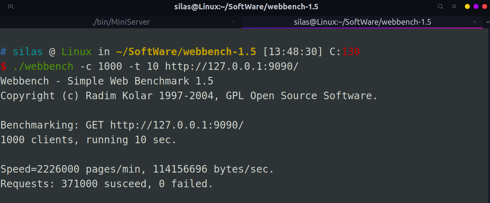

## 项目运行

- 在 MySQL 数据库建表

```mysql
// 建立 webserver 库
create database webserver;

// 创建 user 表
USE webserver;
CREATE TABLE user(
	username char(50) NULL,
	password char(50) NULL
)ENGINE=InnoDB;

// 添加数据 mysql
INSERT INTO user(username, password) VALUES('name', 'password');
```

- 修改 `include/config.h` 中的配置文件
 
- 运行 `autobuild.sh` 脚本，自动编译 cmake

```bash
sh autobuild.sh
```

- 启动服务器

```bash
./bin/MinServer
```
  
- 浏览器输入 `ip:9090` 即可查看运行结果

## 项目文件结构：
```
.
├── bin
│   └── MiniServer      // 可执行文件
├── build               // cmake 构建文件夹
├── include             // 头文件
│   ├── buffer
│   ├── config
│   ├── http
│   ├── log
│   ├── pool
│   ├── server
│   └── timer 
├── log                 // 日志文件夹
│   └── 2023_04_18.log
├── main.cpp            // 主函数
├── resources           // 静态资源，html页面等
├── src                 // 源代码
│   ├── buffer
│   ├── http
│   ├── log
│   ├── pool
│   ├── server
│   ├── timer
│   └── CMakeLists.txt
├── CMakeLists.txt      // cmake文件
└── autobuild.sh        // 自动编译运行脚本
```

## 压测
使用 webbench1.5 进行压测

安装：

```bash
wget http://home.tiscali.cz/~cz210552/distfiles/webbench-1.5.tar.gz
tar zxvf webbench-1.5.tar.gz
cd webbench-1.5
make && make install
```

测试环境：Ubuntu22.04，CPU：i5-12490，内存：32G 

测试结果： 



结果分析：每秒钟响应请求数：2226000 pages/min，每秒钟传输数据量114156696 bytes/sec。并发1000运行10秒后产生的TCP连接数371000个，0个连接失败。说明服务器性能较高。 